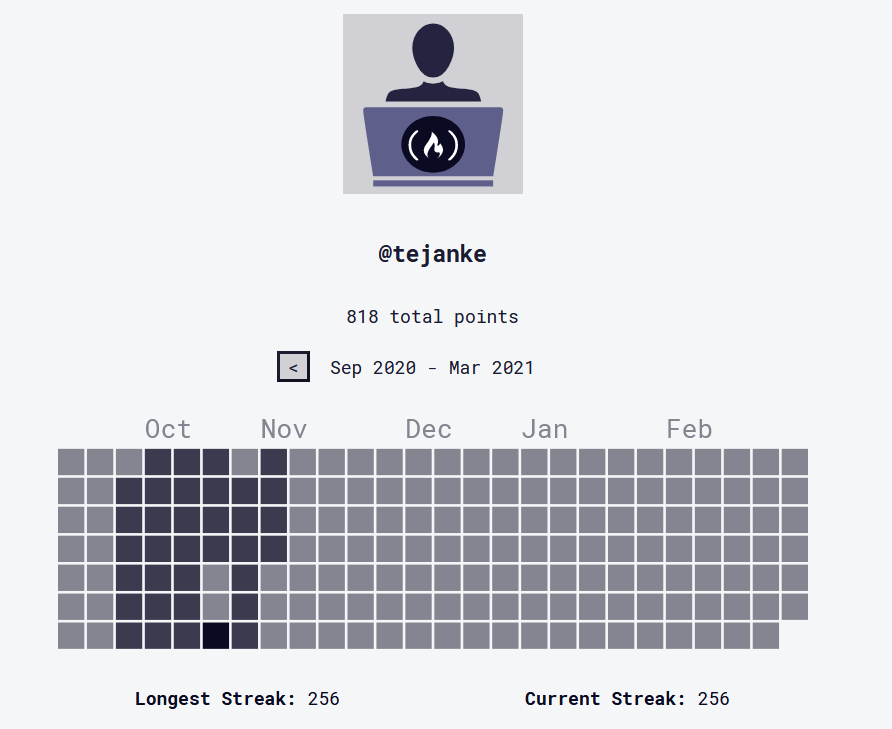

# freeCodeCamp
My [freeCodeCamp](https://www.freecodecamp.org/tejanke) solutions

On 3/5/2021 I finished a 256 day learning streak on the freeCodeCamp platform.  I learned and used HTML, CSS, JavaScript, jQuery, React, D3, NPM, Chai, Python, Numpy, Pandas, and a few other technologies.  Out of all of them I enjoyed learning about JavaScript the most.  I took notes during my sessions, however if I had to do it over again I would have posted all of my challenge solutions to GitHub where I could more easily reference them.

Thanks for the great learning resource!

